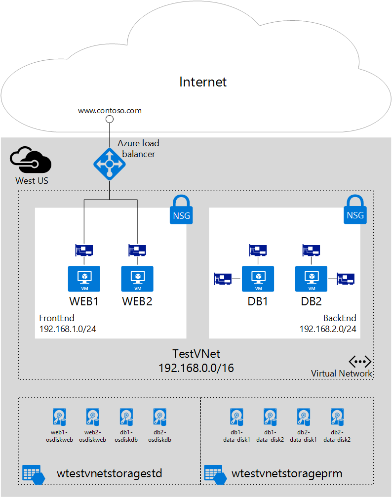

## Szenario

Dieses Dokument wird eine Bereitstellung durchzuführen, die mehrere NICs in virtuellen Computern in einer bestimmten Szenario verwendet. In diesem Szenario müssen Sie eine Arbeitsbelastung IaaS zwei Ebenen in einem Azure gehostet wird. Jede Ebene wird in einem eigenen Subnetz in einem virtuellen Netzwerk (VNet) bereitgestellt. Die front-End-Ebene besteht aus mehreren Webservern, gruppiert werden in ein Lastenausgleich für eine hohe Verfügbarkeit festlegen. Mehrere Datenbankserver besteht die Back-End-Leiste. Diese Datenbankserver werden mit zwei NICs jede, eine Datenbank zugreifen, die andere für die Verwaltung bereitgestellt werden. Das Szenario enthält darüber hinaus Netzwerk Sicherheitsgruppen (NSGs) können Sie steuern, welche Datenverkehr für jedes Subnetz zugelassen wird und NIC in der Bereitstellung. Die folgende Abbildung zeigt die grundlegende Architektur dieses Szenarios an.  

