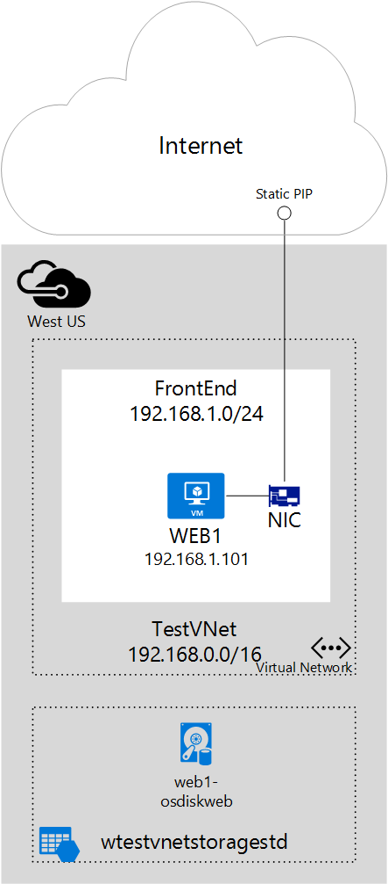

## Szenario

Dieses Dokument wird eine Bereitstellung durchzuführen, die eine statische öffentliche IP-Adresse eines virtuellen Computers (virtueller Computer) zugewiesen verwendet. In diesem Szenario müssen Sie einen einzelnen virtuellen Computer mit einem eigenen statische öffentliche IP-Adresse ein. Der virtuellen Computer ist Teil einer Subnetz mit dem Namen **Front-End** und außerdem wird eine statische private IP-Adresse (**192.168.1.101**) in diesem Subnetz.

Sie können eine statische IP-Adresse für Webservern benötigen, die SSL-Verbindungen erforderlich sind, in denen das SSL-Zertifikat einer IP-Adresse verknüpft ist. 

Führen Sie die folgenden Schritte zur Bereitstellung der Umgebung in der Abbildung oben angezeigt.
