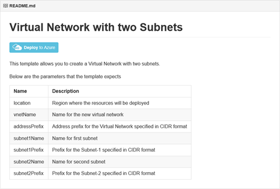
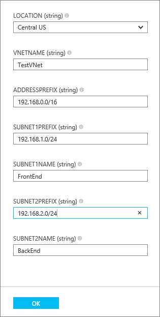
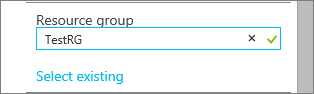
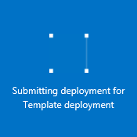
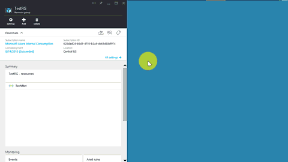

## Bereitstellen der Vorlage Cloud mithilfe klicken Sie auf bereitstellen

Sie können vordefinierte Cloud Vorlagen Upload zu einem Github Repository von Microsoft verwaltet wiederverwenden und zur Community öffnen. Diese Vorlagen können gerade aus Github, bereitgestellt oder heruntergeladen und an Ihre Bedürfnisse anpassen geändert werden. Um eine Vorlage bereitstellen, die eine VNet mit unterschiedlichen zwei erstellt wird, führen Sie die folgenden Schritte aus.

1. Mithilfe eines Browsers und navigieren Sie zu [https://github.com/Azure/azure-quickstart-templates](https://github.com/Azure/azure-quickstart-templates).
2. Führen Sie einen Bildlauf nach unten der Liste der Vorlagen, und klicken Sie auf **101 Vnet zwei Subnetze**. Aktivieren Sie die Datei **README.md** aus, wie unten dargestellt.

    

3. Klicken Sie auf **in Azure bereitstellen**. Geben Sie bei Bedarf Azure Anmeldeinformationen. 
4. Geben Sie in den **Parameter** Blade die Werte, die Sie verwenden, um Ihre neue VNet erstellen möchten, und klicken Sie dann auf **OK**. Die folgende Abbildung zeigt die Werte in diesem Szenario.

    

4. **Ressourcengruppe** klicken Sie auf und wählen Sie die VNet zum Hinzufügen eine Ressourcengruppe aus, oder klicken Sie auf **neu erstellen** , um die VNet zu einer neuen Ressourcengruppe hinzufügen. Die folgende Abbildung zeigt die Ressource gruppeneinstellungen für eine neue Ressourcengruppe **TestRG**bezeichnet.

    

5. Falls erforderlich, ändern Sie die Einstellungen für **Abonnement** und **einen Speicherort** für Ihre VNet.
6. Wenn Sie nicht die VNet als Kachel in der **Startboard**finden Sie unter möchten, deaktivieren Sie **an Startboard anheften**.
5. Klicken Sie auf **Leagl Ausdrücke**, lesen Sie die Konditionen, und klicken Sie auf **kaufen** , um stimmen. 
6. Klicken Sie auf **Erstellen** , um die VNet zu erstellen.

    

7. Nachdem die Bereitstellung abgeschlossen ist, klicken Sie auf **TestVNet** > **Alle Einstellungen** > **Subnetze** , um die Subnetzeigenschaften anzuzeigen, wie unten dargestellt.

    