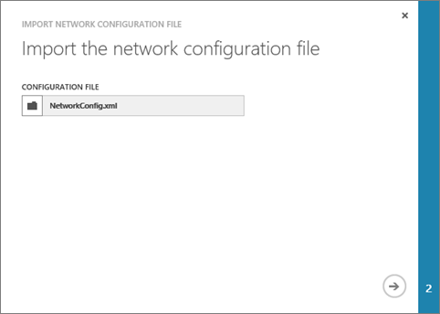

## So erstellen Sie eine VNet mithilfe einer Netzwerk Config-Datei im Azure-Portal

Azure verwendet eine XML-Datei, um alle verfügbaren VNets auf ein Abonnement definieren. Sie können diese Datei herunterladen und bearbeiten sie zum Ändern oder Löschen von vorhandenen VNets und neue erstellen. In diesem Dokument werden Sie erfahren, wie Sie diese Dateidownload genannt Dateien im Netzwerk Konfiguration (oder Netcgf), und bearbeiten, um eine neue VNet erstellen. Weitere Informationen zu den Netzwerk-Konfigurationsdatei der [Azure-virtuellen Netzwerk Konfigurationsschema](https://msdn.microsoft.com/library/azure/jj157100.aspx) zu überprüfen und.

Um eine VNet mithilfe einer Datei Netcfg über das Azure-Portal zu erstellen, führen Sie die folgenden Schritte aus.

1. Mithilfe eines Browsers und navigieren Sie zu http://manage.windowsazure.com und, falls notwendig, melden Sie sich mit Ihrem Azure-Konto.
2. Führen Sie einen Bildlauf nach unten in der Liste der Dienste, und klicken Sie auf **NETZWERKEN** wie folgt.

    

3. Klicken Sie am unteren Rand der Seite auf die Schaltfläche **EXPORTIEREN** , wie unten dargestellt.

    

4. Klicken Sie auf der Seite **Exportieren-Netzwerkkonfiguration** wählen Sie das Abonnement, dem Sie die virtuelle Netzwerkkonfiguration aus exportieren möchten, und klicken Sie dann auf die Schaltfläche Häkchen klicken Sie auf der unteren linken Ecke der Seite.
5. Anweisungen Sie Ihr Browser zum Speichern der Datei **NetworkConfig.xml** . Stellen Sie sicher, dass Sie Folgendes beachten Sie, wo Sie die Datei speichern möchten.
6. Öffnen Sie die Datei, die Sie in Schritt 5 oben mit einem beliebigen XML- oder Text-Editor-Anwendung gespeichert haben, und suchen Sie nach der **<VirtualNetworkSites>** Element. Wenn Sie alle Netzwerke, die bereits erstellt haben, wird jedes Netzwerk angezeigt werden, als eigene **<VirtualNetworkSite>** Element.
7. Um das virtuelle Netzwerk beschrieben, die in diesem Szenario zu erstellen, fügen Sie die folgende XML-Daten direkt unter der **<VirtualNetworkSites>** Element:

        <VirtualNetworkSite name="TestVNet" Location="Central US">
          <AddressSpace>
            <AddressPrefix>192.168.0.0/16</AddressPrefix>
          </AddressSpace>
          <Subnets>
            <Subnet name="FrontEnd">
              <AddressPrefix>192.168.1.0/24</AddressPrefix>
            </Subnet>
            <Subnet name="BackEnd">
              <AddressPrefix>192.168.2.0/24</AddressPrefix>
            </Subnet>
          </Subnets>
        </VirtualNetworkSite>

8.  Speichern Sie die Konfigurationsdatei Netzwerk.
9.  Im Azure-Portal auf der unteren linken Ecke der Seite klicken Sie auf **neu**, und klicken Sie dann klicken Sie auf **Netzwerkdienste**, und klicken Sie dann klicken Sie auf **Virtuelle Netzwerk**, und klicken Sie dann auf **Konfiguration importieren** , wie in der folgenden Abbildung gezeigt.

    

10.  Klicken Sie auf der Seite **Importieren der Konfigurationsdatei Netzwerk** klicken Sie auf **Durchsuchen für Datei...**, und klicken Sie dann navigieren Sie zu dem Ordner, den, dem Sie in Schritt 8 oben Ihre Datei gespeichert, wählen Sie die Datei aus und klicken Sie dann auf **Öffnen**. Der Webseite sollte der folgenden Abbildung ähneln. Klicken Sie auf der unteren rechten Ecke der Seite klicken Sie auf die Pfeilschaltfläche verschieben mit dem nächsten Schritt fort.

    

11.   Klicken Sie auf der Seite **Erstellen Ihres Netzwerks** Beachten Sie den Eintrag für Ihre neue VNet, wie in der folgenden Abbildung gezeigt.

    

12.   Klicken Sie auf die Schaltfläche Häkchen auf der unteren rechten Ecke der Seite, um die VNet zu erstellen. Nach ein paar Sekunden werden in der Liste der verfügbaren VNets, Ihre VNet angezeigt, wie in der folgenden Abbildung gezeigt.

    