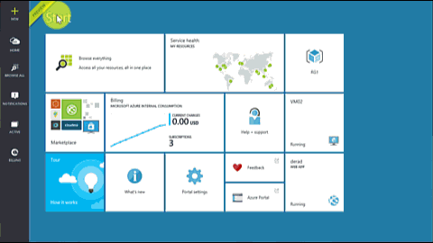
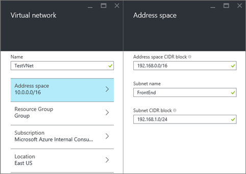
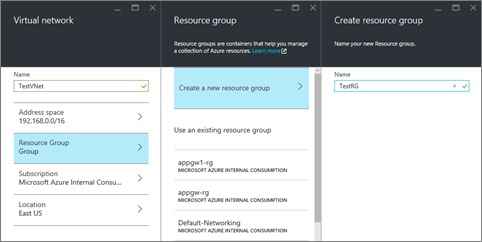
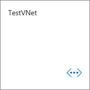
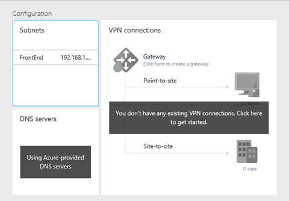
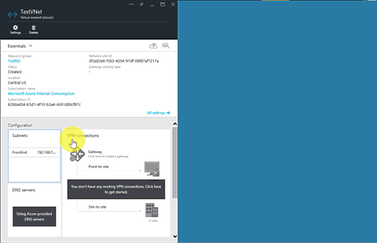

## So erstellen Sie eine klassische VNet Azure-Portal

Führen Sie zum Erstellen einer klassischen VNet basierend auf dem oben genannten Szenario die folgenden Schritte aus.

1. Mithilfe eines Browsers und navigieren Sie zu http://portal.azure.com und, falls notwendig, melden Sie sich mit Ihrem Azure-Konto.
2. Klicken Sie auf **neu** > **Networking** > **virtuellen Netzwerk**, beachten Sie, dass die Liste **Wählen Sie ein Modell zur Bereitstellung von** bereits zeigt **klassischen**, und klicken Sie dann auf **Erstellen**, wie in der folgenden Abbildung gezeigt.

    

3. Geben Sie auf das Blade **virtuellen Netzwerk** den **Namen** der VNet, und klicken Sie dann auf **Adressbereichs**. Konfigurieren Sie Ihre Adresse Speicherplatz für die VNet und deren erste Subnetz und dann auf **OK**. Die folgende Abbildung zeigt die Einstellungen für den Zugriffsschutz CIDR in diesem Szenario.

    

4. Klicken Sie auf **Ressourcengruppe** und wählen Sie eine Ressourcengruppe aus der VNet zum Hinzufügen, oder klicken Sie auf **neue Ressourcengruppe erstellen** , um die VNet einer neuen Ressourcengruppe hinzuzufügen. Die folgende Abbildung zeigt die Ressource gruppeneinstellungen für eine neue Ressourcengruppe **TestRG**bezeichnet. Weitere Informationen zu Ressourcengruppen finden Sie auf [Azure Ressourcenmanager Übersicht](../articles/virtual-network/resource-group-overview.md#resource-groups).

    

5. Falls erforderlich, ändern Sie die Einstellungen für **Abonnement** und **einen Speicherort** für Ihre VNet. 

6. Wenn Sie nicht die VNet als Kachel in der **Startboard**finden Sie unter möchten, deaktivieren Sie **an Startboard anheften**. 

7. Klicken Sie auf **Erstellen** , und beachten Sie die Kachel mit dem Namen **Erstellen von virtuellen Netzwerk** , wie in der folgenden Abbildung gezeigt.

    

8. Warten Sie, bis die VNet erstellt werden soll, und wenn Sie die Kachel unten angezeigt wird, klicken Sie auf, um weitere Subnetze hinzuzufügen.

    

9. Sie sollten die **Konfiguration** für Ihre VNet sehen, wie unten dargestellt. 

    

10. Klicken Sie auf **Subnets** > **Hinzufügen**, geben Sie einen **Namen** , und geben Sie einen **Adressbereichs (CIDR Block)** für Ihr Subnetz, und klicken Sie dann auf **OK**. Die folgende Abbildung zeigt die Einstellungen für das aktuelle Szenario.

    