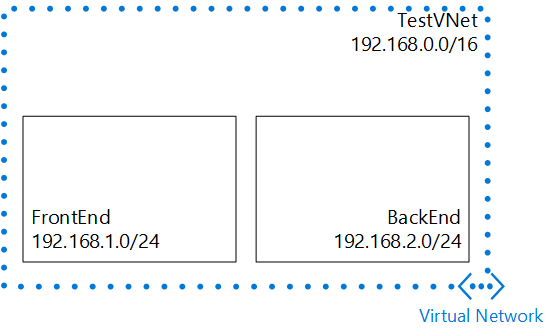

## Szenario

Wenn Sie um zum Erstellen einer VNet und Subnetze besser zu veranschaulichen, wird dieses Dokument folgenden Szenario verwendet.

In diesem Szenario erstellen Sie eine VNet mit dem Namen **TestVNet** mit reservierte CIDR **192.168.0.0./16**einen Textblock. Ihre VNet werden die folgenden Subnetze enthalten: 

- **Front-End**, **192.168.1.0/24** als deren CIDR-Block verwenden.
- **Back-End-**, **192.168.2.0/24** als deren CIDR-Block verwenden.

 