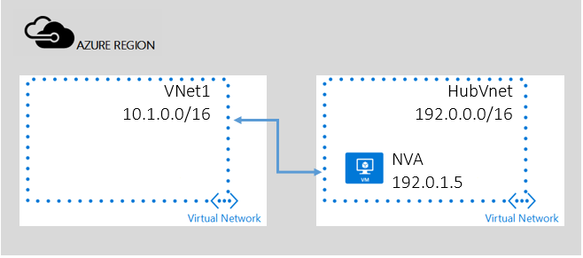

## Verketten - Übertragung durch hervorragendem VNet Service

Obwohl die Verwendung von System leitet den Datenverkehr automatisch für die Bereitstellung erleichtert, gibt es Fälle, in denen Sie das routing von Paketen über eine virtuelle Einheit steuern möchten.
In diesem Szenario gibt es zwei VNets in einem Abonnement, HubVNet und VNet1 wie in der Abbildung unten beschrieben. Sie bereitstellen Netzwerk virtuelle Appliance(NVA) in VNet HubVNet. Nach dem Einrichten des VNet zwischen HubVNet und VNet1 peering, können Benutzer definiert Arbeitspläne einrichten und geben Sie den nächsten Abschnitt zum NVA in der HubVNet.

> [AZURE.NOTE] Einfach zu verwendenden wird angenommen Sie, dass alle VNets hier im selben Abonnement sind. Aber funktioniert auch für Szenario Cross-Abonnement.

So aktivieren Sie während der Übertragung routing die wichtigste Eigenschaft ist der "Weitergeleitet Datenverkehr zulassen"-Parameter. Dadurch wird akzeptiert und Datenverkehr aus dem und in der NVA in der hervorragendem VNet zu senden.  
