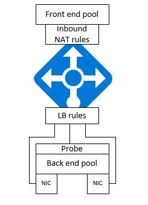

## Lastenausgleich
Ein Lastenausgleich wird verwendet, wenn Sie Ihre Applikationen skalieren möchten. Typischerweise Szenarien beinhalten, Applikationen für mehrere Instanzen von virtuellen Computer ausgeführt wird. Die virtuellen Computer Instanzen werden durch ein Lastenausgleich Produktkatalogsystem, die trägt dazu bei, den unterschiedlichen Instanzen Netzwerkverkehr verteilen. 

| Eigenschaft | Beschreibung |
|---|---|
| *frontendIPConfigurations* | ein Lastenausgleich kann eine oder mehrere front-End IP-Adressen bekannt als virtuelle IP-Adressen (VIPs) enthalten. Diese IP-Adressen können dienen als eingehende für den Datenverkehr und öffentliche IP-Adresse oder private IP- |
|*backendAddressPools* | Hierbei handelt es sich um die virtuellen Computer NICs, der beim Laden verteilt wird, zugeordneten IP-Adressen |
|*loadBalancingRules* | eine Regeleigenschaft Zuordnung zu einem angegebenen front-End-IP- und Port Tastenkombination, um eine Reihe von Back-End-IP-Adressen und Kombination aus. Mit einer einzigen Definition einer laden Lastenausgleich Ressource Sie können mehrere Regeln für den Lastenausgleich definieren, jede Regel, die eine Kombination aus einer Vorderseite über die entsprechenden IP-Adresse und den Port beenden und End-IP- und virtuellen Computern verbundenen Port zurück. Die Regel ist ein Port in der front-End-Ressourcenpool zu viele virtuelle Computer in die Back-End-Ressourcenpool |  
| *Untersucht* | Prüfpunkte können Sie die Integrität des virtuellen Computer Instanzen verfolgen. Wenn ein Prüfpunkt Gesundheit fehlschlägt, wird die Instanz des virtuellen Computers Drehung automatisch genommen werden |
| *inboundNatRules* | NAT-Regeln, die den eingehenden Verkehr über der Vorderseite parallelen definiert IP zu beenden, und klicken Sie auf die Back-End-IP zu einer bestimmten virtuellen Computern Instanz verteilt. NAT Regel ist ein Port im front-End-Pool zu einem virtuellen Computern in die Back-End-Ressourcenpool | 

Beispiel für Laden Lastenausgleich Vorlage im Json-Format:

    {
      "$schema": "https://schema.management.azure.com/schemas/2015-01-01/deploymentTemplate.json#",
      "contentVersion": "1.0.0.0",
      "parameters": {
        "dnsNameforLBIP": {
          "type": "string",
          "metadata": {
            "description": "Unique DNS name"
          }
        },
        "location": {
          "type": "string",
          "allowedValues": [
            "East US",
            "West US",
            "West Europe",
            "East Asia",
            "Southeast Asia"
          ],
          "metadata": {
            "description": "Location to deploy"
          }
        },
        "addressPrefix": {
          "type": "string",
          "defaultValue": "10.0.0.0/16",
          "metadata": {
            "description": "Address Prefix"
          }
        },
        "subnetPrefix": {
          "type": "string",
          "defaultValue": "10.0.0.0/24",
          "metadata": {
            "description": "Subnet Prefix"
          }
        },
        "publicIPAddressType": {
          "type": "string",
          "defaultValue": "Dynamic",
          "allowedValues": [
            "Dynamic",
            "Static"
          ],
          "metadata": {
            "description": "Public IP type"
          }
        }
      },
      "variables": {
        "virtualNetworkName": "virtualNetwork1",
        "publicIPAddressName": "publicIp1",
        "subnetName": "subnet1",
        "loadBalancerName": "loadBalancer1",
        "nicName": "networkInterface1",
        "vnetID": "[resourceId('Microsoft.Network/virtualNetworks',variables('virtualNetworkName'))]",
        "subnetRef": "[concat(variables('vnetID'),'/subnets/',variables('subnetName'))]",
        "publicIPAddressID": "[resourceId('Microsoft.Network/publicIPAddresses',variables('publicIPAddressName'))]",
        "lbID": "[resourceId('Microsoft.Network/loadBalancers',variables('loadBalancerName'))]",
        "nicId": "[resourceId('Microsoft.Network/networkInterfaces',variables('nicName'))]",
        "frontEndIPConfigID": "[concat(variables('lbID'),'/frontendIPConfigurations/loadBalancerFrontEnd')]",
        "backEndIPConfigID": "[concat(variables('nicId'),'/ipConfigurations/ipconfig1')]"
      },
      "resources": [
    {
      "apiVersion": "2015-05-01-preview",
      "type": "Microsoft.Network/publicIPAddresses",
      "name": "[variables('publicIPAddressName')]",
      "location": "[parameters('location')]",
      "properties": {
        "publicIPAllocationMethod": "[parameters('publicIPAddressType')]",
        "dnsSettings": {
          "domainNameLabel": "[parameters('dnsNameforLBIP')]"
        }
      }
    },
    {
      "apiVersion": "2015-05-01-preview",
      "type": "Microsoft.Network/virtualNetworks",
      "name": "[variables('virtualNetworkName')]",
      "location": "[parameters('location')]",
      "properties": {
        "addressSpace": {
          "addressPrefixes": [
            "[parameters('addressPrefix')]"
          ]
        },
        "subnets": [
          {
            "name": "[variables('subnetName')]",
            "properties": {
              "addressPrefix": "[parameters('subnetPrefix')]"
            }
          }
        ]
      }
    },
    {
      "apiVersion": "2015-05-01-preview",
      "type": "Microsoft.Network/networkInterfaces",
      "name": "[variables('nicName')]",
      "location": "[parameters('location')]",
      "dependsOn": [
        "[concat('Microsoft.Network/virtualNetworks/', variables('virtualNetworkName'))]",
        "[concat('Microsoft.Network/loadBalancers/', variables('loadBalancerName'))]"
      ],
      "properties": {
        "ipConfigurations": [
          {
            "name": "ipconfig1",
            "properties": {
              "privateIPAllocationMethod": "Dynamic",
              "subnet": {
                "id": "[variables('subnetRef')]"
              },
              "loadBalancerBackendAddressPools": [
                {
                  "id": "[concat(variables('lbID'), '/backendAddressPools/LoadBalancerBackend')]"
                }
              ],
              "loadBalancerInboundNatRules": [
                {
                  "id": "[concat(variables('lbID'),'/inboundNatRules/RDP')]"
                }
              ]
            }
          }
        ]
      }
    },
    {
      "apiVersion": "2015-05-01-preview",
      "name": "[variables('loadBalancerName')]",
      "type": "Microsoft.Network/loadBalancers",
      "location": "[parameters('location')]",
      "dependsOn": [
        "[concat('Microsoft.Network/publicIPAddresses/', variables('publicIPAddressName'))]"
      ],
      "properties": {
        "frontendIPConfigurations": [
          {
            "name": "loadBalancerFrontEnd",
            "properties": {
              "publicIPAddress": {
                "id": "[variables('publicIPAddressID')]"
              }
            }
          }
        ],
        "backendAddressPools": [
          {
            "name": "loadBalancerBackEnd"
          }
        ],
        "inboundNatRules": [
          {
            "name": "RDP",
            "properties": {
              "frontendIPConfiguration": {
                "id": "[variables('frontEndIPConfigID')]"
              },
              "protocol": "tcp",
              "frontendPort": 3389,
              "backendPort": 3389,
              "enableFloatingIP": false
            }
          }
        ]
      }
    }
      ]
    }

### Zusätzliche Ressourcen

Lesen Sie weitere Informationen [zum Lastenausgleich REST-API](https://msdn.microsoft.com/library/azure/mt163651.aspx) .
