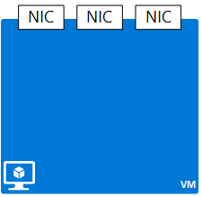

## NIC
 
Eine Netzwerk-Oberfläche Netzwerkschnittstellenkarte Ressource bietet Netzwerkkonnektivität zu einem vorhandenen Subnetz in einer Ressource VNet. Obwohl Sie einen anderen Netzwerkadapter als eigenständige Anwendung Objekt erstellen können, müssen Sie es in ein anderes Objekt-Konnektivität zu ermöglichen zuzuordnen. Ein Netzwerkadapter kann Verbindung ein virtuellen Computers zu einem Subnetz, eine öffentliche IP-Adresse oder ein Lastenausgleich verwendet werden.  

|Eigenschaft|Beschreibung|Beispielwerte|
|---|---|---|
|**virtualMachine**|Virtueller Computer die NIC zugeordnet ist.|/Subscriptions/{GUID}/../Microsoft.Compute/virtualMachines/VM1|
|**macAddress**|MAC-Adresse für den Netzwerkadapter|Jeder Wert zwischen 4 und 30|
|**networkSecurityGroup**|NSG, die NIC zugeordnet ist|/Subscriptions/{GUID}/../Microsoft.Network/networkSecurityGroups/myNSG1|
|**dnsSettings**|DNS-Einstellungen für den Netzwerkadapter|finden Sie unter [PIP](#Public-IP-address)|

Eine Network Interface Card oder NIC, stellt eine Netzwerk-Benutzeroberfläche, die mit einer virtuellen Computern (virtueller Computer) verknüpft werden können. Ein virtueller Computer kann ein oder mehrere Netzwerkadapter haben.

### IP-Konfigurationen
NICs verfügen über ein untergeordnetes Objekt mit dem Namen **IpConfigurations** , enthält die folgenden Eigenschaften:

|Eigenschaft|Beschreibung|Beispielwerte|
|---|---|---|
|**Subnetz**|Subnetz die NIC ist verbunden.|/Subscriptions/{GUID}/../Microsoft.Network/virtualNetworks/myvnet1/Subnets/mysub1|
|**Priv.IP-Adresse**|IP-Adresse für den Netzwerkadapter im Subnetz|10.0.0.8|
|**privateIPAllocationMethod**|Die Methode IP-Verteilung|Dynamische oder statische|
|**enableIPForwarding**|Gibt an, ob die NIC für das routing verwendet werden können|WAHR oder falsch|
|**Primärschlüssel**|Gibt an, ob die primäre NIC für den virtuellen Computer ist die NIC|WAHR oder falsch|
|**Öffentl.IP**|Die NIC zugeordnet PIP|finden Sie unter [DNS-Einstellungen](#DNS-settings)|
|**loadBalancerBackendAddressPools**|Ende-Adresspools aus, denen die NIC zugeordnet ist, zurück||
|**loadBalancerInboundNatRules**|Eingehende laden Lastenausgleich NAT Regeln, die, denen die NIC zugeordnet ist.||

Beispiel für öffentliche IP-Adresse im JSON-Format:

    {
        "name": "lb-nic1-be",
        "id": "/subscriptions/xxxxxxxx-xxxx-xxxx-xxxx-xxxxxxxxxxxx/resourceGroups/nrprg/providers/Microsoft.Network/networkInterfaces/lb-nic1-be",
        "etag": "W/\"xxxxxxxx-xxxx-xxxx-xxxx-xxxxxxxxxxxx\"",
        "type": "Microsoft.Network/networkInterfaces",
        "location": "eastus",
        "properties": {
            "provisioningState": "Succeeded",
            "resourceGuid": "xxxxxxxx-xxxx-xxxx-xxxx-xxxxxxxxxxxx",
            "ipConfigurations": [
                {
                    "name": "NIC-config",
                    "id": "/subscriptions/xxxxxxxx-xxxx-xxxx-xxxx-xxxxxxxxxxxx/resourceGroups/nrprg/providers/Microsoft.Network/networkInterfaces/lb-nic1-be/ipConfigurations/NIC-config",
                    "etag": "W/\"0027f1a2-3ac8-49de-b5d5-fd46550500b1\"",
                    "properties": {
                        "provisioningState": "Succeeded",
                        "privateIPAddress": "10.0.0.4",
                        "privateIPAllocationMethod": "Dynamic",
                        "subnet": {
                            "id": "/subscriptions/xxxxxxxx-xxxx-xxxx-xxxx-xxxxxxxxxxxx/resourceGroups/NRPRG/providers/Microsoft.Network/virtualNetworks/NRPVnet/subnets/NRPVnetSubnet"
                        },
                        "loadBalancerBackendAddressPools": [
                            {
                                "id": "/subscriptions/xxxxxxxx-xxxx-xxxx-xxxx-xxxxxxxxxxxx/resourceGroups/nrprg/providers/Microsoft.Network/loadBalancers/nrplb/backendAddressPools/NRPbackendpool"
                            }
                        ],
                        "loadBalancerInboundNatRules": [
                            {
                                "id": "/subscriptions/xxxxxxxx-xxxx-xxxx-xxxx-xxxxxxxxxxxx/resourceGroups/nrprg/providers/Microsoft.Network/loadBalancers/nrplb/inboundNatRules/rdp1"
                            }
                        ]
                    }
                }
            ],
            "dnsSettings": { ... },
            "macAddress": "00-0D-3A-10-F1-29",
            "enableIPForwarding": false,
            "primary": true,
            "virtualMachine": {
                "id": "/subscriptions/xxxxxxxx-xxxx-xxxx-xxxx-xxxxxxxxxxxx/resourceGroups/nrprg/providers/Microsoft.Compute/virtualMachines/web1"
            }
        }
    }

### Zusätzliche Ressourcen

- Lesen Sie die [REST-API Dokumentation zur](https://msdn.microsoft.com/library/azure/mt163579.aspx) für Netzwerkkarten.
