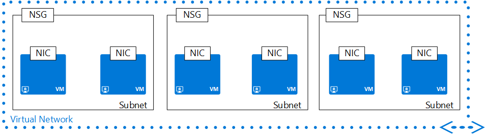

## Virtuelles Netzwerk
Virtuelle Netzwerke (VNET) und Subnetze Ressourcen können eine Begrenzungslinie Sicherheit für Auslastung in Azure ausgeführt definiert werden. Eine VNet ist durch eine Zusammenstellung von Adresse Leerzeichen, als CIDR-Blocks definiert charakterisiert. 

>[AZURE.NOTE] Netzwerk-Administratoren sind mit CIDR-Notation vertraut. Wenn Sie nicht mit CIDR, [erfahren Sie mehr über](http://whatismyipaddress.com/cidr)vertraut sind.

VNets enthalten die folgenden Eigenschaften.

|Eigenschaft|Beschreibung|Beispielwerte|
|---|---|---|
|**addressSpace**|Sammlung von Adresspräfixe, die die VNet in CIDR-Notation zusammensetzt|192.168.0.0/16|
|**Subnetze**|Sammlung von Subnetzen, die die VNet zusammensetzt|finden Sie unter [Subnetze](#Subnets) unten.|
|**IP-Adresse**|IP-Adresse zu einem Objekt zugewiesen ist. Dies ist eine schreibgeschützte Eigenschaft.|104.42.233.77|

### Subnetze
Ein Subnetz ist eine untergeordnete Ressource von einem VNet und Hilfe bei der Definition der Adresse Leerzeichen innerhalb eines CIDR-Blocks mit IP-Adresspräfixe Segmente. NICs können Subnetze hinzugefügt und auf virtuellen Computern, die eine Verbindung herstellt für verschiedene Auslastung verbunden werden.

Subnetze enthalten die folgenden Eigenschaften. 

|Eigenschaft|Beschreibung|Beispielwerte|
|---|---|---|
|**addressPrefix**|Einzelne Adresspräfix, die das Subnetz in CIDR-Notation zusammensetzt|192.168.1.0/24|
|**networkSecurityGroup**|NSG im Subnetz angewendet|finden Sie unter [NSGs](#Network-Security-Group)|
|**routeTable**|Routingtabelle mit dem Subnetz angewendet|finden Sie unter [UDR](#Route-table)|
|**ipConfigurations**|Sammlung von IP-bei Objekte, die mit dem Subnetz verbunden NICs verwendet|finden Sie unter [UDR](#Route-table)|

Beispiel für VNet im JSON-Format:

    {
        "name": "TestVNet",
        "id": "/subscriptions/xxxxxxxx-xxxx-xxxx-xxxx-xxxxxxxxxxxx/resourceGroups/TestRG/providers/Microsoft.Network/virtualNetworks/TestVNet",
        "etag": "W/\"xxxxxxxx-xxxx-xxxx-xxxx-xxxxxxxxxxxx\"",
        "type": "Microsoft.Network/virtualNetworks",
        "location": "westus",
        "tags": {
            "displayName": "VNet"
        },
        "properties": {
            "provisioningState": "Succeeded",
            "resourceGuid": "xxxxxxxx-xxxx-xxxx-xxxx-xxxxxxxxxxxx",
            "addressSpace": {
                "addressPrefixes": [
                    "192.168.0.0/16"
                ]
            },
            "subnets": [
                {
                    "name": "FrontEnd",
                    "id": "/subscriptions/xxxxxxxx-xxxx-xxxx-xxxx-xxxxxxxxxxxx/resourceGroups/TestRG/providers/Microsoft.Network/virtualNetworks/TestVNet/subnets/FrontEnd",
                    "etag": "W/\"xxxxxxxx-xxxx-xxxx-xxxx-xxxxxxxxxxxx\"",
                    "properties": {
                        "provisioningState": "Succeeded",
                        "addressPrefix": "192.168.1.0/24",
                        "networkSecurityGroup": {
                            "id": "/subscriptions/xxxxxxxx-xxxx-xxxx-xxxx-xxxxxxxxxxxx/resourceGroups/TestRG/providers/Microsoft.Network/networkSecurityGroups/NSG-BackEnd"
                        },
                        "routeTable": {
                            "id": "/subscriptions/xxxxxxxx-xxxx-xxxx-xxxx-xxxxxxxxxxxx/resourceGroups/TestRG/providers/Microsoft.Network/routeTables/UDR-FrontEnd"
                        },
                        "ipConfigurations": [
                            {
                                "id": "/subscriptions/xxxxxxxx-xxxx-xxxx-xxxx-xxxxxxxxxxxx/resourceGroups/TestRG/providers/Microsoft.Network/networkInterfaces/NICWEB1/ipConfigurations/ipconfig1"
                            },
                            ...]
                    }
                },
                ...]
        }
    }

### Zusätzliche Ressourcen

- Erhalten Sie weitere Informationen zum [VNet](../articles/virtual-network/virtual-networks-overview.md).
- Lesen Sie die [REST-API Dokumentation zur](https://msdn.microsoft.com/library/azure/mt163650.aspx) für VNets ein.
- Lesen Sie die [REST-API Dokumentation zur](https://msdn.microsoft.com/library/azure/mt163618.aspx) für Subnetze.