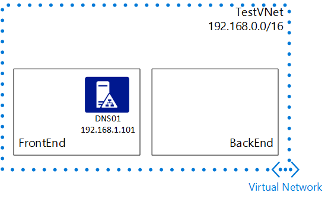

## Szenario

Um eine statische IP-Adresse für einen virtuellen Computer konfigurieren besser zu veranschaulichen, wird dieses Dokument folgenden Szenario verwendet.

In diesem Szenario werden Sie einen virtuellen Computer mit dem Namen **DNS01** in der **Front-End** -Subnetz erstellen und festlegen, dass statische IP-Adresse **192.168.1.101**verwenden.

 