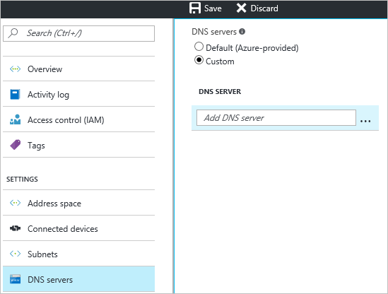

Mit dieser Einstellung können Sie den DNS-Server angeben, den Sie für die Auflösung von Namen für diese virtuelle Netzwerk verwenden möchten. Es wird einen DNS-Server nicht erstellt.

1. Navigieren Sie zu **DNS-Server** , und klicken Sie zum Öffnen des DNS-Server-Blades, auf der Seite **Einstellungen** für das virtuelle Netzwerk.
2. Wählen Sie auf der Seite **DNS-Server** **DNS-Server**klicken Sie unter **Benutzerdefiniert**aus.
3. Geben Sie im Feld **DNS-Server** im Feld **Hinzufügen von DNS-Server** die IP-Adresse des DNS-Servers, die für die namensauflösung verwendet werden soll.
4. Wenn Sie das Hinzufügen von DNS-Server fertig sind, klicken Sie am oberen Rand der Blade **Speichern** , um die Konfiguration zu speichern.

    
