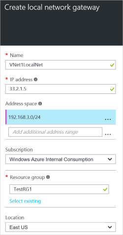

1. Im Portal aus **alle Ressourcen**klicken Sie auf **+ Hinzufügen**. Klicken Sie in das **Alles** Blade Suchfeld Geben Sie ein **Gateway für lokales Netzwerk**und dann auf zum Suchen. Dadurch wird eine Liste zurückgegeben. Klicken Sie auf **Lokales Netzwerkgateway** , um das Blade zu öffnen, und klicken Sie dann klicken Sie auf **Erstellen** , um das Blade **Erstellen lokales Netzwerkgateway** zu öffnen.

    

2. Klicken Sie auf das **Erstellen lokales Netzwerk Gateway Blade**Geben Sie einen **Namen** für Ihr lokales Netzwerk Gateway-Objekt aus.
 
3. Geben Sie eine gültige öffentliche **IP-Adresse** für den VPN-Gerät oder virtuelle Netzwerk-Gateway, den Sie eine Verbindung herstellen möchten. Wenn diese lokale Netzwerk einen lokalen Speicherort darstellt, ist dies die öffentliche IP-Adresse des Geräts VPN, die Sie in eine Verbindung herstellen möchten. Es nicht hinter NAT und Azure erreichbar sein soll. Wenn diese lokale Netzwerk ein anderes VNet darstellt, geben Sie die öffentliche IP-Adresse an, die mit dem Gateway virtuelles Netzwerk für die VNet zugewiesen wurde. 

4. **Adressbereichs** bezieht sich auf die Adressbereiche für das Netzwerk, das diesem lokale Netzwerk darstellt. Sie können mehrere Adressbereiche Abstand hinzufügen. Stellen Sie sicher, dass die Bereiche, die Sie hier angeben nicht mit anderen Netzwerken Zellbereiche, die Sie überlappen in eine Verbindung herstellen möchten.
 
5. Für **Abonnements**stellen Sie sicher, dass das richtige Abonnement angezeigt wird.

6. Wählen Sie für **Ressourcengruppe**die Ressourcengruppe aus, die Sie verwenden möchten. Sie können entweder eine neue Ressourcengruppe erstellen, oder wählen Sie eine, die Sie bereits erstellt haben.

7. **Speicherort**wählen Sie einen Speicherort für dem in diesem Objekt erstellt wird. Soll am selben Speicherort auswählen, dem in Ihrem VNet befindet, aber es ist nicht dazu erforderlich.

8. Klicken Sie auf **Erstellen** , um das Gateway lokales Netzwerk zu erstellen.
