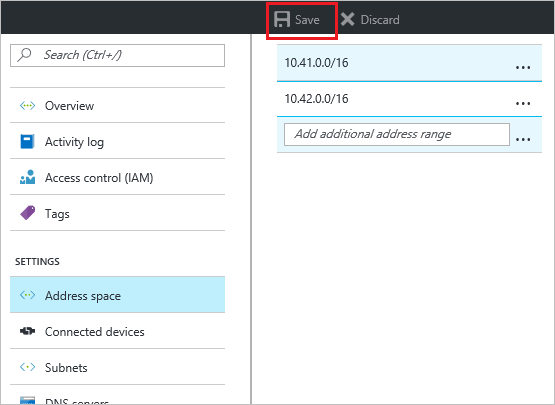
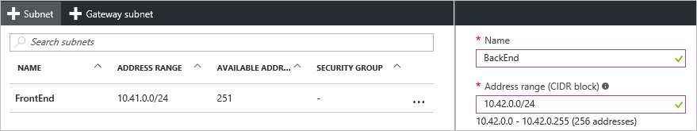

### Hinzufügen des Adressbereichs

1. Klicken Sie auf **Adressbereichs** , um die Adresse Leerzeichen Blade öffnen, um zusätzliche Adressbereichs, unter dem Abschnitt **Einstellungen** für Ihre Blade virtuelles Netzwerk hinzuzufügen.

2. Fügen Sie den Abstand zusätzliche Adresse, und klicken Sie dann auf **Speichern** , am oberen Rand der Blade.

    

### Zum Erstellen von Subnetzen 

1. Um Subnetze, im Abschnitt **Einstellungen** von Ihrer Blade virtuelles Netzwerk zu erstellen, klicken Sie auf **Subnetze** , um das Blade **Subnetze** zu öffnen. 

2. Klicken Sie in das Blade Subnetze auf **+ Subnetz** um das **Hinzufügen Subnetz** Blade zu öffnen. Benennen Sie Ihre neue Subnetz, und geben Sie den Adressbereich.

         
3. Klicken Sie auf **OK** am unteren Rand der Blade um die Änderungen zu speichern.

    
