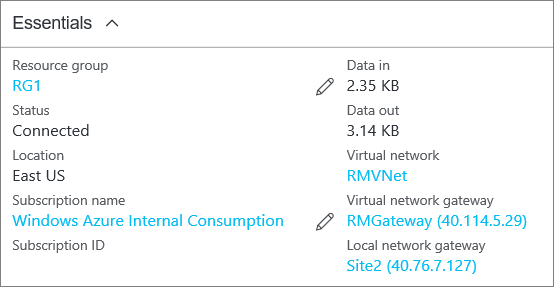

### Überprüfen die Verbindung mithilfe der PowerShell

Sie können überprüfen, dass die Verbindung mithilfe von erfolgreich die `Get-AzureRmVirtualNetworkGatewayConnection` Cmdlet, mit oder ohne `-Debug`. 

1. Verwenden Sie die folgenden Cmdlet Beispiel konfigurieren die Werte für Ihre eigenen entsprechen. Wenn Sie dazu aufgefordert werden, wählen Sie 'A' und 'Alle' ausführen aus. Im Beispiel `-Name` bezieht sich auf den Namen der Verbindung, die Sie erstellt haben, und testen möchten.

        Get-AzureRmVirtualNetworkGatewayConnection -Name MyGWConnection -ResourceGroupName MyRG

2. Nachdem das Cmdlet hat, zeigt die Werte. Im folgenden Beispiel der Verbindungsstatus als "Verbunden" zeigt, und sehen Sie eingehende und Ausgang Bytes.

        Body:
        {
          "name": "MyGWConnection",
          "id":
        "/subscriptions/086cfaa0-0d1d-4b1c-94544-f8e3da2a0c7789/resourceGroups/MyRG/providers/Microsoft.Network/connections/MyGWConnection",
          "properties": {
            "provisioningState": "Succeeded",
            "resourceGuid": "1c484f82-23ec-47e2-8cd8-231107450446b",
            "virtualNetworkGateway1": {
              "id":
        "/subscriptions/086cfaa0-0d1d-4b1c-94544-f8e3da2a0c7789/resourceGroups/MyRG/providers/Microsoft.Network/virtualNetworkGa
        teways/vnetgw1"
            },
            "localNetworkGateway2": {
              "id":
        "/subscriptions/086cfaa0-0d1d-4b1c-94544-f8e3da2a0c7789/resourceGroups/MyRG/providers/Microsoft.Network/localNetworkGate
        ways/LocalSite"
            },
            "connectionType": "IPsec",
            "routingWeight": 10,
            "sharedKey": "abc123",
            "connectionStatus": "Connected",
            "ingressBytesTransferred": 33509044,
            "egressBytesTransferred": 4142431
          }

### Überprüfen die Verbindung mit dem Azure-portal

Der Azure-Portal können Sie den Status der Verbindung durch Navigieren zu der Verbindung anzeigen. Es gibt mehrere Möglichkeiten zur Verfügung. Eine Möglichkeit, navigieren Sie zu der Verbindung und überprüfen anzeigen die folgenden Schritte

1. Klicken Sie auf **alle Ressourcen** , und navigieren Sie zu Ihrer virtuelle Netzwerk-Gateway, im [Azure-Portal](http://portal.azure.com).
2. Klicken Sie auf das Blade für Ihr virtuelles Netzwerk-Gateway klicken Sie auf **Verbindungen**. Sie können den Status der jeweiligen Verbindung anzeigen.
3. Klicken Sie auf den Namen der Verbindung, die Sie zum Öffnen von **Essentials**überprüft werden soll. In Essentials können Sie weitere Informationen über die Verbindung anzuzeigen. Der **Status** ist "Erfolgreich" und "Verbunden", wenn Sie eine erfolgreiche Verbindung hergestellt haben.

    