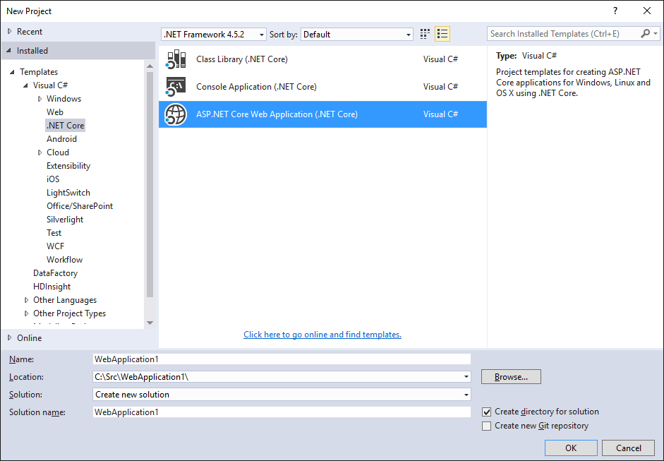
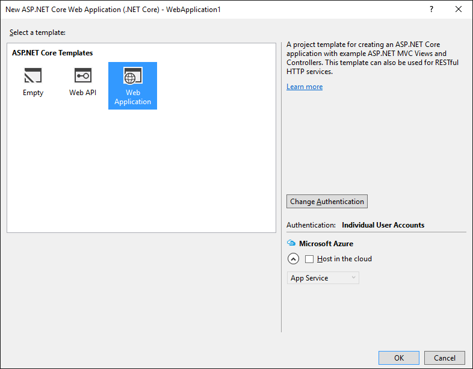

1. Wählen Sie im Menü Visual Studio **Datei > Neu > Projekt**. 

1. Wählen Sie unter dem Abschnitt **Vorlagen** im Dialogfeld **Neues Projekt** aus **C#-> .NET Core**.

1. Wählen Sie **ASP.NET Core Web-Anwendung (.NET Core)**aus.
    

1. Benennen Sie Ihre neuen Anwendung (oder die Standardeinstellung), und tippen Sie auf **OK**.  

1. Wählen Sie unter **ASP.NET Core Vorlagen** **.NET Core**aus.
    

1. Deaktivieren Sie **in der Cloud Host** , wie Sie Docker als Ihre Lösung für die Bereitstellung verwenden möchten.

