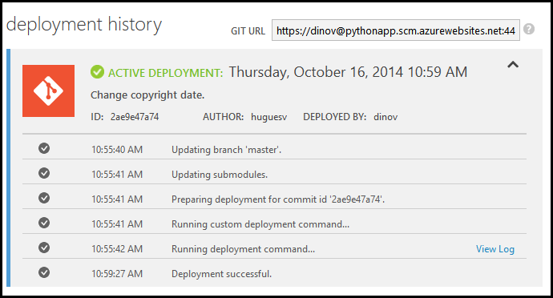
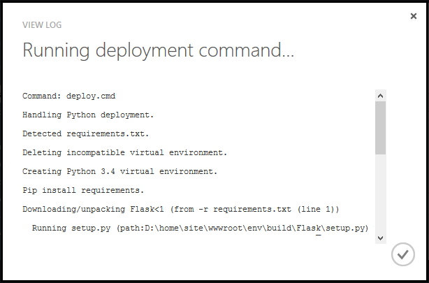

Wenn Sie benötigen, um zu überprüfen, die Bereitstellung ausgeben, einschließlich der Ausgabe des Bereitstellung benutzerdefinierte Skripts, navigieren Sie zur Seite **BEREITSTELLUNGEN** Azure-Portal.

Erweitern Sie die gewünschte Bereitstellung aus:

Klicken Sie auf **Protokoll anzeigen** , um die Ausgabe der benutzerdefinierten Bereitstellungsskript anzuzeigen:

